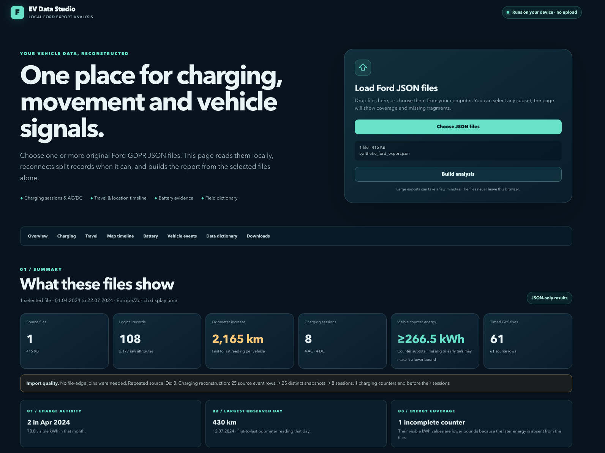

# Local Ford EV Data Studio

Open **`index.html`** in a current Chrome, Edge, Firefox, or Safari browser. Select one or more original Ford GDPR JSON export files and choose **Build analysis**. The page reads the files on your device and produces the full dashboard and its CSV downloads. No server, installation, or preprocessing is needed.

The page is self-contained: its code, field descriptions, charts, and map geography are bundled in one HTML file. The Ford JSON data is **not** bundled; select it when you open the page. The map works offline and does not request tiles.

## Try the example

Open `index.html`, choose [`examples/synthetic_ford_export.json`](examples/synthetic_ford_export.json), and select **Build analysis**. The example follows the observed Ford export structure and includes fabricated AC and DC charges, battery state, travel, location, and vehicle events. Its identifiers, dates, coordinates, and readings are synthetic. Use your own Ford JSON files to analyze a real vehicle.

## Screenshots

These screenshots show the finished report loaded with the synthetic example. They contain no real vehicle data.



[Overview charts](docs/dashboard-charts.png) · [Charging sessions](docs/dashboard-charging.png) · [Map timeline](docs/dashboard-map.png) · [CSV downloads](docs/dashboard-downloads.png)

## What the page builds

- Overview charts for monthly odometer movement, visible charging energy, daily distance, and AC/DC mix.
- Charging sessions with start/end time, SOC, AC/DC type, visible kWh, an approximate total where the selected JSON provides enough evidence, observed average kW, duration, a counter-coverage flag, filters, and CSV export.
- Movement, ignition, door, command, fault, and warning summaries derived from the selected JSON.
- An offline GPS and charging-stop timeline map with AC and DC filters.
- Battery-energy/SOC consistency and 80%-SOC displayed-range plots, with a clear limit on state-of-health claims.
- A field dictionary with frequencies, nested field counts, an observed JSON schema, and CSV/JSON downloads.

All displayed local dates use **Europe/Zurich**. CSV files also include UTC timestamps. Multiple vehicles are tagged with anonymous vehicle numbers; no VIN is shown or exported by the dashboard.

## Interpretation limits

The importer expects Ford's `{"attrList":[...]}` export structure. It joins records split across selected files only when their field-order signatures give an unambiguous match. If a subset lacks one half of a record, the report warns about incomplete fragments. Repeated source-record IDs are skipped in vehicle analysis; raw field frequencies still count every original attribute.

Charging kWh is the visible Ford charging-counter subtotal. **≥** marks incomplete counter coverage without a reset, such as an early tail or missing reading; the absence of this flag is not proof of completeness. Reset rows are marked separately: their subtotals reconstructed from counter segments are uncertain, so the page does not label those values or an aggregate containing them as strict lower bounds. Average kW covers the portion between counter samples; it is not a peak charger-power measurement. The AC/DC label comes from Ford's explicit charging-power-type field. The dashboard counts sessions in the requested 6–12 kW band, but power alone cannot confirm a home or public charger.

For an early-ending **AC** counter with enough observations, the dashboard can show an **≈ estimated total**. It projects measured energy per hour over the missing time and checks that against the energy per SOC point measured in the same session. When that method lacks enough evidence, a second method can estimate the missing energy from the battery-percentage gain and the median observed counter kWh per SOC point in clean reference sessions for the **same vehicle and charger type** (AC or DC) in the selected Ford JSON. With a usable counter subtotal, the reference method estimates its missing tail. After a counter reset or with no usable reading, it estimates the whole session from the full SOC gain instead. It requires sufficient consistent peers and may remain unavailable when readings are sparse. The charging table labels the method; the CSV includes its basis, reference-session count and calibration slope.

The next charging state can give a higher SOC without giving a final kWh reading. A later session starts a new counter and does not reveal the prior session's final energy. SOC rounding, changing charging conditions, and losses mean that **≈ is a rough estimate, not a guaranteed minimum, Ford meter reading or wall-meter total**. Approximate values remain separate from the recorded-energy totals. DC sessions do not receive the time-rate extrapolation because fast-charging power can change sharply.

GPS positions can be coarse; the map groups them into approximate 0.1° areas. Ignition intervals are not a verified trip log. The export does not provide a defensible battery state-of-health percentage or usable-capacity measurement through this analysis.

## Rebuilding the one-page file

`index.html` is already built. If you edit the source files, run this optional PowerShell command in this folder:

```powershell
pwsh -File ./build.ps1
```

The build script only embeds the local CSS, JavaScript, definitions, and geography into `index.html`; it does not touch or preprocess Ford JSON files.

## Development checks and private data

Run `node test_engine.mjs` and `node test_dashboard.mjs` for synthetic checks. To check an original export locally, run `node test_real_export.mjs /path/to/export-directory`. The optional integration check contains no vehicle-specific expected values and does not copy the export into this repository.

Keep original Ford JSON exports and downloaded CSV reports outside the Git repository. The `.gitignore` also excludes these files if they are accidentally copied here.
